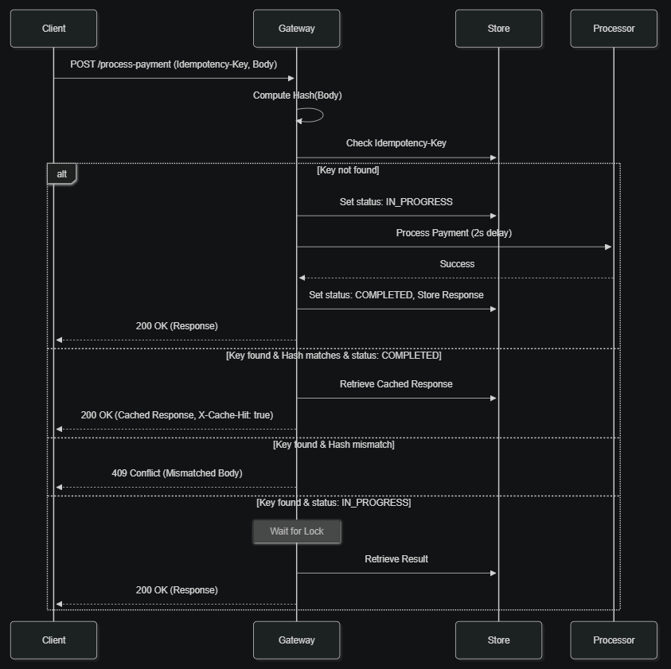

# Idempotency Gateway API

A high-performance middleware service designed to ensure that payment requests are processed **exactly once**, preventing double-charging during network retries or concurrent attempts.

## 1. Architecture Overview

This diagram illustrates the sequence of operations within the Idempotency Gateway, showing how requests are hashed, locked, and cached to ensure exactly-once processing.



The Idempotency Gateway operates as a protective layer between the client and the payment processing logic. It ensures that every unique request is handled exactly once, even in the event of retries or concurrent submissions.

### How it Works:

1.  **Unique Identification**: Every request must include a `Idempotency-Key` in the header. This key uniquely identifies the transaction attempt from the client's perspective.
2.  **Payload Integrity (Hashing)**: The gateway computes a SHA256 hash of the request body. If a key is reused with a different body, the gateway detects this mismatch and returns a `409 Conflict`, preventing accidental data corruption.
3.  **Concurrency Control (Locking)**: To prevent "race conditions" where two identical requests arrive at the exact same millisecond, the gateway uses a locking mechanism. The first request to arrive acquires a lock for that specific key; subsequent requests for the same key will wait until the first one is finished.
4.  **State Management**:
    *   **IN_PROGRESS**: While the payment is being processed, the status is marked as "In Progress".
    *   **COMPLETED**: Once processing is done, the response is cached, and the status is updated to "Completed".
5.  **Fast Retrieval**: If a request with a known key and matching hash arrives, the gateway immediately returns the cached response from its store, bypassing the processing logic and ensuring the client receives a consistent result without double-charging.

## 2. Setup Instructions

### Prerequisites
- Python 3.10+

### Installation
1. Navigate to the project directory:
   ```bash
   cd backend/Idempotency-gateway/
   ```

2. Install dependencies:
   ```bash
   pip install -r requirements.txt
   ```

3. Run the application:
   ```bash
   uvicorn main:app --reload
   ```

4. **Run all tests at once**:
   You can easily verify the entire system by running all tests at the same time with this command:
   ```bash
   pytest
   ```

## 3. API Documentation

### POST `/process-payment`
Processes a payment transaction with idempotency protection.

**Headers:**
- `Idempotency-Key` (Required): A unique string identifying the request.

**Request Body:**
```json
{
  "amount": 100.0,
  "currency": "GHS"
}
```

**Responses:**
- `200 OK`: Payment processed successfully or returned from cache.
- `400 Bad Request`: Missing `Idempotency-Key` header.
- `409 Conflict`: `Idempotency-Key` reused for a different request body.

---

### GET `/payment-status/{idempotency_key}`
Checks the current status of a specific transaction.

**Responses:**
- `200 OK`: Returns the stored response or `{"status": "IN_PROGRESS"}`.
- `404 Not Found`: No record found for the provided key.

## 4. Design Decisions

### Hashing (SHA256)
We use SHA256 hashing on the request body to ensure data integrity. If a client reuses an `Idempotency-Key` but changes the payload (e.g., changing the amount), the system detects the hash mismatch and returns a `409 Conflict`. This prevents accidental or malicious reuse of keys for different transactions.

### Concurrency Locks (`asyncio.Lock`)
To handle race conditions where identical requests arrive simultaneously, we implement a per-key locking mechanism using `asyncio.Lock`. Only the first request acquires the lock and starts processing. Subsequent requests wait for the lock to be released, then retrieve the cached result of the first request.

### In-Memory Store
The current implementation uses a native Python dictionary to store transaction states. This allows for extremely fast lookups. In a production environment, this would be replaced with a distributed store like Redis to support horizontal scaling.

## 5. Extra feature: Payment Status Endpoint
The `/payment-status` endpoint lets you check if a payment is still being processed or if it is already finished. This is helpful because you can check the status at any time without having to send the payment again.
