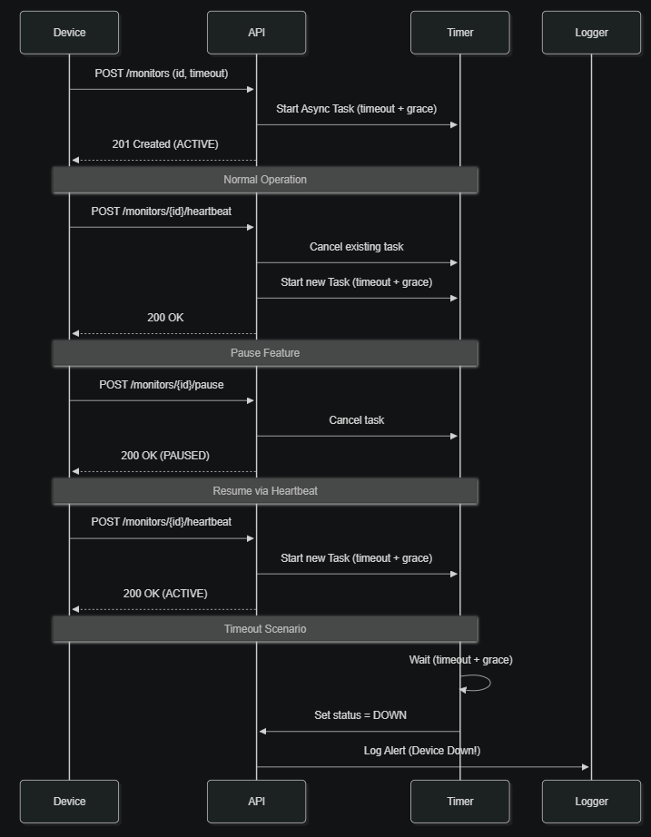

# Pulse-Check (Dead Man’s Switch) API

Pulse-Check is a robust Python-based API built with FastAPI designed to monitor the health and connectivity of remote devices or services. It acts as a "Dead Man’s Switch," where devices must periodically send a "heartbeat" to prove they are still functional. If a heartbeat is missed beyond a configured timeout (plus a grace period), the system triggers an alert.

## Architecture

The diagram below illustrates the complete lifecycle of a pulse monitor. It starts with the registration of a new device, which initializes an asynchronous timer. The flow shows how subsequent heartbeats reset this timer to maintain an `ACTIVE` status, how the `PAUSE` functionality can temporarily halt monitoring without triggering alerts, and finally, how the system automatically transitions a monitor to the `DOWN` state and logs an alert if the combined timeout and grace period expire without a heartbeat.



## Setup Instructions

### Prerequisites
- Python 3.10+

### Installation
1. Clone the repository and navigate to the project directory.
2. Install dependencies:
   ```bash
   pip install -r requirements.txt
   ```

> [!IMPORTANT]
> You **must** install the dependencies using the command above before attempting to run the server or tests.

### Running the App
Start the server using Uvicorn:
```bash
uvicorn main:app --reload
```
The API will be available at `http://127.0.0.1:8000`.

## API Documentation

### 1. Register Monitor
**POST** `/monitors`
- **Request Body:**
  ```json
  {
    "id": "device-123",
    "timeout": 60,
    "alert_email": "admin@example.com"
  }
  ```
- **Success Response (201 Created):**
  ```json
  {
    "id": "device-123",
    "timeout": 60,
    "status": "ACTIVE",
    "alert_email": "admin@example.com"
  }
  ```

### 2. Send Heartbeat
**POST** `/monitors/{id}/heartbeat`
- **Description:** Resets the timer for an ACTIVE monitor or resumes a PAUSED monitor.
- **Success Response (200 OK):**
  ```json
  {
    "message": "Heartbeat received, monitoring active"
  }
  ```

### 3. Pause Monitor
**POST** `/monitors/{id}/pause`
- **Description:** Stops the timer completely. No alerts will fire until a heartbeat is received.
- **Success Response (200 OK):**
  ```json
  {
    "message": "Monitor paused"
  }
  ```

## Design Decisions

- **Asyncio:** Used for non-blocking concurrency. Each monitor runs its own lightweight `asyncio.create_task`, allowing the API to handle thousands of concurrent timers without the overhead of threads or processes.
- **In-Memory Store:** A Python dictionary is used for rapid prototyping and low-latency access. It stores monitor metadata and references to active `asyncio` tasks.
- **Timer Management:** Timers are managed by creating and cancelling `asyncio` tasks. When a heartbeat or pause request is received, the existing task is explicitly cancelled to prevent redundant alerts.

## Developer’s Choice: Grace Period

### What is it?
A fixed 5-second buffer (`GRACE_PERIOD = 5`) added to every monitor's timeout.

### Why it was added?
In real-world networks, packets can be delayed due to jitter or temporary congestion. Without a grace period, a device that sends a heartbeat at exactly 60 seconds might be flagged as "DOWN" if the packet arrives at 60.1 seconds.

### How it improves reliability?
By waiting for `timeout + 5` seconds, we significantly reduce false-positive alerts, ensuring that the system only triggers when a device is truly unresponsive.

## Testing

Run the automated test suite using `pytest`:
```bash
pytest test_main.py
```
